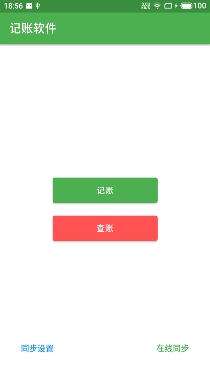
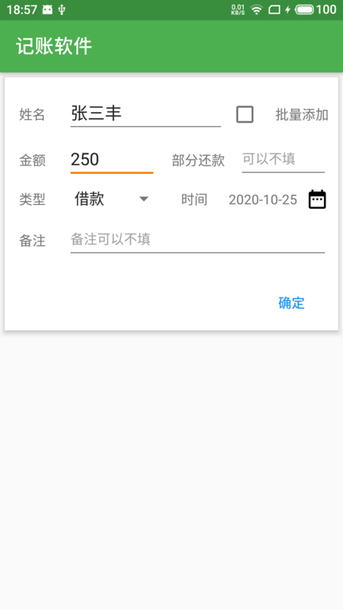
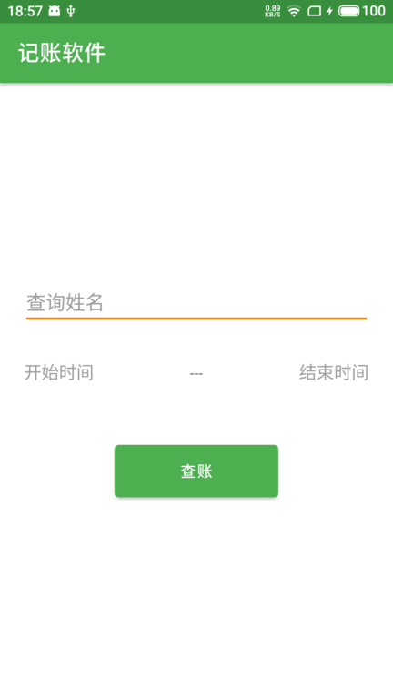
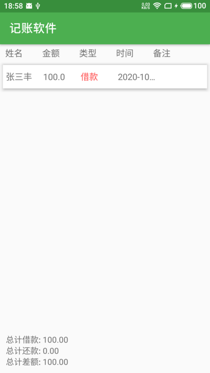
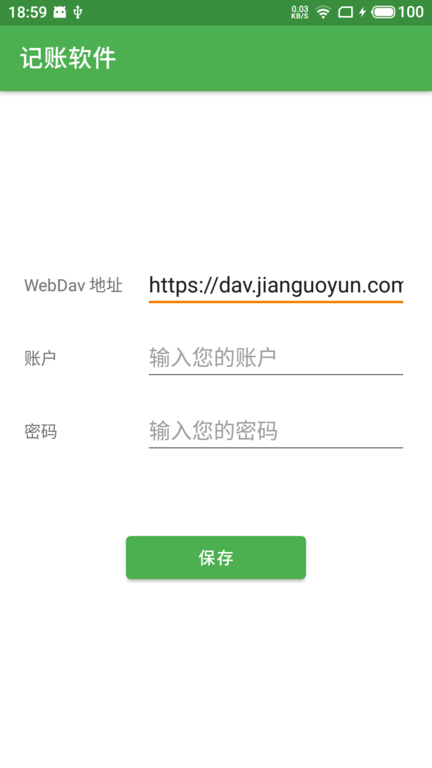

<h1 align="center">MoneyTracker</h1> 

  
A simple and intutive money tracker with cloud sync android app.

 

## Screenshots

## Tech stack & Open-source libraries
- Minimum SDK level 21
- 100% [Kotlin](https://kotlinlang.org/) based + [Coroutines](https://github.com/Kotlin/kotlinx.coroutines) + [Flow](https://kotlin.github.io/kotlinx.coroutines/kotlinx-coroutines-core/kotlinx.coroutines.flow/) for asynchronous
- Manual dependency injection
- Room Persistence - construct database
- DateStore - Jetpack data storage
- WorkManager - Jetpack asynchronous task
- [Sardine](https://github.com/thegrizzlylabs/sardine-android) - A WebDAV library for Android 
- [CustomActivityOnCrash](https://github.com/Ereza/CustomActivityOnCrash) - android library that allows launching a custom activity when your app crashes
